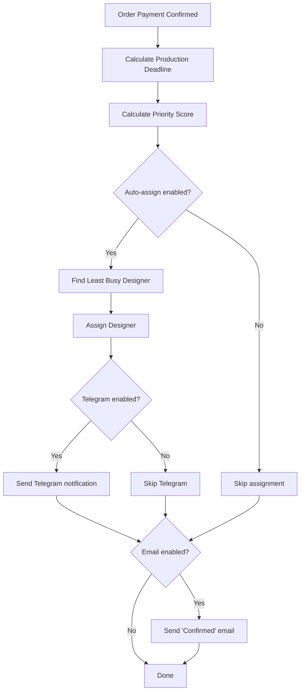
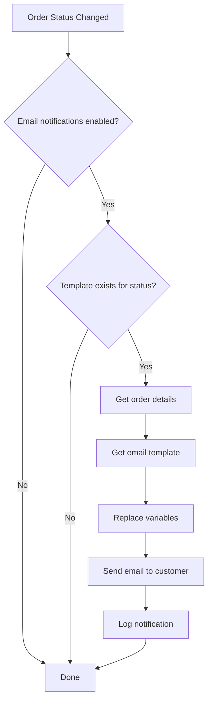

# Production Queue Automation System

Intelligent production queue management with automatic deadlines, prioritization, designer assignment, and customer notifications.

## Features Overview

### 1. ⏰ Automatic Deadline Calculation

When an order is paid, the system automatically calculates production deadline based on:

**Base Production Days:**
- Standard order: **5 working days**
- Express tag (⚡ Відправити швидше): **2 working days**

**Additional Time Adjustments:**
- Large volume (>60 pages): **+1 day**
- Queue overloaded (>20 active orders): **+1 day**

**Working Days Calculation:**
- Excludes weekends (Saturday, Sunday)
- Can be extended to exclude Ukrainian holidays

**Example:**
```
Order paid: Monday, March 4
Pages: 40 (standard)
Has express tag: No
Active orders: 15

Calculation:
- Base days: 5 working days
- No extra days (40 pages < 60, 15 orders < 20)
- Result: Monday, March 11
```

### 2. 🎯 Auto-Prioritization

Orders in production queue are automatically sorted by priority:

**Priority Rules (in order):**
1. **Closest deadline** → highest priority
2. **Express tag (⚡)** → boost priority by 2 positions
3. **VIP customer (⭐)** → boost priority by 1 position
4. **Manual override** → admin can drag-and-drop to override

**Priority Score Calculation:**
```javascript
score = milliseconds_until_deadline
if (has_express_tag) score -= 2 days
if (is_vip_customer) score -= 1 day
if (manual_override) score = manual_override
```

**Queue Display:**
- Lower score = higher in queue
- Visual badges: 🔥 Critical, ⚡ Urgent, ⚡ Express, ⭐ VIP
- Deadline status: Overdue (red), Today (amber), 2+ days (green)

### 3. 🎨 Auto-Designer Assignment

When enabled, automatically assigns orders to designers with least workload.

**Assignment Algorithm:**
1. Find all designers (staff with role 'designer' or 'admin')
2. Calculate workload for each:
   - Active orders count
   - Total pages in queue
3. Sort by: fewest orders → fewest pages
4. Assign to least busy designer

**Workload Calculation:**
```javascript
for each designer:
  active_orders = orders in [confirmed, in_production, quality_check]
  total_pages = sum of page_count from active_orders

assign to designer with min(active_orders, total_pages)
```

**Manual Override:**
- Admin can manually (re)assign any order
- Admin can unassign designer from order

### 4. 📧 Automated Customer Notifications

Automatically send emails to customers when order status changes.

**Default Email Templates:**

#### ✅ Confirmed
**Subject:** "Ваше замовлення підтверджено - TouchMemories"
**Sent when:** Order status changes to `confirmed`
**Variables:** {{customer_name}}, {{order_number}}, {{product_title}}, {{production_deadline}}

#### 🖨️ In Production
**Subject:** "Ваша фотокнига друкується - TouchMemories"
**Sent when:** Order status changes to `in_production`
**Content:** "Наша команда працює над створенням вашої унікальної фотокниги! 📸✨"

#### 📦 Shipped
**Subject:** "Відправлено! Ваше замовлення в дорозі - TouchMemories"
**Sent when:** Order status changes to `shipped`
**Variables:** {{tracking_number}}, {{tracking_url}}
**Auto-generates:** Nova Poshta tracking URL from TTN

#### ✨ Delivered
**Subject:** "Доставлено! Сподіваємось вам сподобається - TouchMemories"
**Sent when:** Order status changes to `delivered`
**Content:** Call-to-action for reviews and social media mentions

**Template Management:**
- Editable in admin panel (`/admin/settings/email-templates`)
- Can enable/disable per status
- Preview with sample data
- Supports variables: {{customer_name}}, {{order_number}}, etc.

### 5. 💬 Telegram Notifications for Designers

Real-time notifications to designers via Telegram Bot.

**Setup Process:**
1. Create bot via [@BotFather](https://t.me/botfather)
2. Get bot token → add to `TELEGRAM_BOT_TOKEN` env variable
3. Designer starts chat with bot and sends `/start`
4. Bot replies with their `chat_id`
5. Admin adds `chat_id` to designer's staff profile

**Notification Types:**

#### 🎨 New Order Assigned
```
⚡ ЕКСПРЕС 🎨 Нове замовлення призначено вам!

Замовлення: #TM-2024-001
Клієнт: Олена Коваленко
Товар: Фотокнига "Весілля" (30x30см, 40 сторінок)
Сторінок: 40
Дедлайн: 15 березня 2024 р.

[Переглянути замовлення]

Успішної роботи! 💙
```

#### ⚠️ Deadline Approaching
Sent when deadline is within 2 working days:
```
⚠️ Наближається дедлайн!

Замовлення: #TM-2024-001
Дедлайн: 15 березня 2024 р.
Залишилось: 2 дні
```

#### 🚨 Overdue Alert
Sent when deadline has passed:
```
🚨 ПРОСТРОЧЕНО!

Замовлення: #TM-2024-001
Дедлайн був: 15 березня 2024 р.
Прострочено на: 2 дні

Будь ласка, терміново завершіть це замовлення
```

#### ☀️ Daily Digest
Sent every morning with summary:
```
☀️ Доброго ранку, Іван!

📊 Ваша робоча панель на сьогодні:

• Активних замовлень: 8
• Всього сторінок: 320
• Дедлайн сьогодні: 2
• Дедлайн цього тижня: 5

Продуктивного дня! 💪
```

## Database Schema

### automation_settings
```sql
id UUID PRIMARY KEY
auto_assign_designer BOOLEAN DEFAULT TRUE
notify_designer_telegram BOOLEAN DEFAULT TRUE
notify_customer_email BOOLEAN DEFAULT TRUE
standard_production_days INTEGER DEFAULT 5
express_production_days INTEGER DEFAULT 2
high_volume_threshold INTEGER DEFAULT 60
high_volume_extra_days INTEGER DEFAULT 1
busy_queue_threshold INTEGER DEFAULT 20
busy_queue_extra_days INTEGER DEFAULT 1
express_priority_boost INTEGER DEFAULT 2
vip_priority_boost INTEGER DEFAULT 1
created_at TIMESTAMPTZ
updated_at TIMESTAMPTZ
```

### email_templates
```sql
id UUID PRIMARY KEY
status_trigger TEXT (confirmed|in_production|shipped|delivered|cancelled)
subject TEXT
body TEXT
enabled BOOLEAN DEFAULT TRUE
created_at TIMESTAMPTZ
updated_at TIMESTAMPTZ
UNIQUE(status_trigger)
```

### orders (added columns)
```sql
production_deadline TIMESTAMPTZ
priority_score BIGINT
manual_priority_override INTEGER
assigned_designer_id UUID → staff(id)
```

### staff (added column)
```sql
telegram_chat_id TEXT
```

## API Endpoints

### Automation Settings
- `GET /api/automation/settings` - Get settings
- `PATCH /api/automation/settings` - Update settings

### Designer Assignment
- `POST /api/automation/assign-designer` - Assign designer
  - Body: `{ order_id, designer_id }` - Manual assignment
  - Body: `{ order_id, auto: true }` - Auto-assignment
- `GET /api/automation/assign-designer` - Get designer workloads

### Payment Processing
- `POST /api/automation/process-payment` - Process payment automation
  - Body: `{ order_id }`
  - Calculates deadline, assigns designer, sends notifications

### Notifications
- `POST /api/automation/notify-status-change` - Send status change notification
  - Body: `{ order_id, old_status, new_status }`

### Production Queue
- `GET /api/production/queue` - Get prioritized queue
- `PATCH /api/production/queue/priority` - Update manual priority
  - Body: `{ order_id, position }`
- `DELETE /api/production/queue/priority` - Clear manual override
  - Body: `{ order_id }`

## Admin UI Pages

### Production Queue (`/admin/production/queue`)
- Drag-and-drop to manually reorder
- Summary cards: Total, Express, VIP, Unassigned
- Each item shows:
  - Priority badge (🔥 Critical, ⚡ Urgent, ⭐ VIP, etc.)
  - Customer name & order number
  - Product title & page count
  - Deadline with color coding
  - Assigned designer (or assign button)
  - Manual override indicator
- Click item → assign/reassign designer
- Drag item → apply manual priority override
- Clear override → restore auto-prioritization

### Automation Settings (`/admin/settings/automation`)
- Toggle auto-assign designer
- Toggle Telegram notifications
- Toggle email notifications
- Configure production days (standard/express)
- Configure thresholds (high volume, busy queue)
- Configure priority boosts (express, VIP)

### Email Templates (`/admin/settings/email-templates`)
- List all templates by status
- Edit subject & body
- Enable/disable per status
- Preview with sample data
- Variables guide: {{customer_name}}, {{order_number}}, etc.

## Automation Flow

### When Order Is Paid



### When Status Changes



## Environment Variables

Add to `.env.local`:

```bash
# Email (Resend)
RESEND_API_KEY=re_...

# Telegram Bot
TELEGRAM_BOT_TOKEN=123456:ABC-DEF...

# Supabase (already configured)
NEXT_PUBLIC_SUPABASE_URL=...
NEXT_PUBLIC_SUPABASE_ANON_KEY=...
```

## Setup Instructions

### 1. Database Setup

Run SQL schema:
```bash
psql -U postgres -d touchmemories -f lib/supabase/schema/automation.sql
```

### 2. Configure Email (Resend)

1. Sign up at [resend.com](https://resend.com)
2. Get API key
3. Add to `.env.local`: `RESEND_API_KEY=re_...`
4. Verify domain for production

### 3. Configure Telegram Bot

1. Open Telegram and message [@BotFather](https://t.me/botfather)
2. Send `/newbot` and follow instructions
3. Copy bot token
4. Add to `.env.local`: `TELEGRAM_BOT_TOKEN=123456:ABC...`
5. Designers message your bot and send `/start`
6. Bot replies with their `chat_id`
7. Admin adds `chat_id` to staff profile

### 4. Enable Automation

Navigate to `/admin/settings/automation`:
- ✅ Enable auto-assign designer
- ✅ Enable Telegram notifications
- ✅ Enable email notifications
- Configure production days
- Configure thresholds

### 5. Integrate with Payment Flow

In your payment webhook/success handler:

```typescript
await fetch('/api/automation/process-payment', {
  method: 'POST',
  headers: { 'Content-Type': 'application/json' },
  body: JSON.stringify({ order_id: 'xxx' }),
});
```

### 6. Integrate with Status Changes

When updating order status:

```typescript
// Update status
await supabase
  .from('orders')
  .update({ status: 'shipped', tracking_number: 'TTN' })
  .eq('id', orderId);

// Trigger notification
await fetch('/api/automation/notify-status-change', {
  method: 'POST',
  headers: { 'Content-Type': 'application/json' },
  body: JSON.stringify({
    order_id: orderId,
    old_status: 'in_production',
    new_status: 'shipped',
  }),
});
```

## Usage Examples

### Manually Assign Designer

```javascript
await fetch('/api/automation/assign-designer', {
  method: 'POST',
  body: JSON.stringify({
    order_id: 'xxx',
    designer_id: 'yyy',
  }),
});
```

### Auto-Assign Designer

```javascript
await fetch('/api/automation/assign-designer', {
  method: 'POST',
  body: JSON.stringify({
    order_id: 'xxx',
    auto: true,
  }),
});
```

### Override Queue Priority

```javascript
// Drag order to position 0 (top of queue)
await fetch('/api/production/queue/priority', {
  method: 'PATCH',
  body: JSON.stringify({
    order_id: 'xxx',
    position: 0,
  }),
});
```

### Clear Manual Override

```javascript
await fetch('/api/production/queue/priority', {
  method: 'DELETE',
  body: JSON.stringify({
    order_id: 'xxx',
  }),
});
```

## Future Enhancements

- [ ] WhatsApp notifications for customers
- [ ] SMS notifications for critical deadlines
- [ ] Slack integration for team notifications
- [ ] AI-powered deadline prediction based on historical data
- [ ] Capacity planning dashboard
- [ ] Designer performance analytics
- [ ] Automated deadline extension requests
- [ ] Customer self-service deadline tracking
- [ ] Integration with calendar apps (Google Calendar, Outlook)
- [ ] Multi-timezone support for international customers

## Troubleshooting

### Email notifications not sending
1. Check `RESEND_API_KEY` is set
2. Verify domain in Resend dashboard
3. Check automation settings: `notify_customer_email` is enabled
4. Check template is enabled for that status
5. Check Resend logs for errors

### Telegram notifications not sending
1. Check `TELEGRAM_BOT_TOKEN` is set
2. Verify designer has `telegram_chat_id` in staff profile
3. Check automation settings: `notify_designer_telegram` is enabled
4. Test bot manually: send message to bot

### Auto-assignment not working
1. Check automation settings: `auto_assign_designer` is enabled
2. Verify there are designers (staff with role 'designer' or 'admin')
3. Check Supabase logs for errors
4. Manually trigger: `POST /api/automation/assign-designer`

### Deadlines incorrect
1. Check automation settings for production days
2. Verify order custom_attributes has correct `page_count`
3. Check if express tag is detected: `⚡ Відправити швидше`
4. Check active orders count (affects busy queue threshold)

## Support

For issues or questions:
1. Check this documentation
2. Review code in `lib/automation/`
3. Check API logs in Vercel
4. Check Supabase logs for database errors
5. Test automation endpoints manually with Postman
